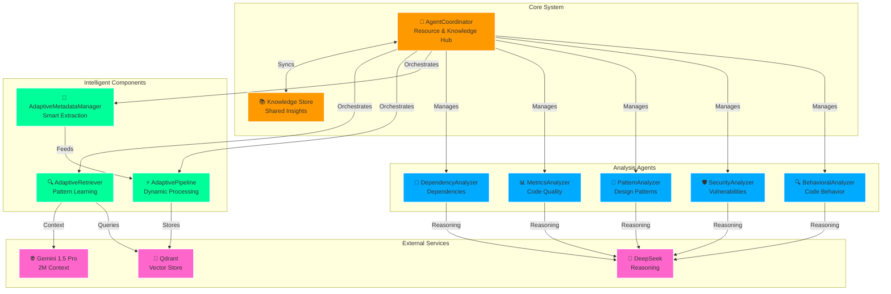
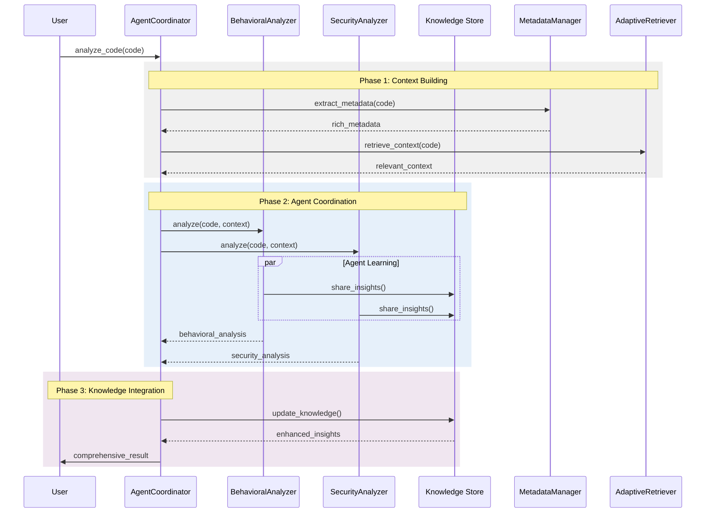
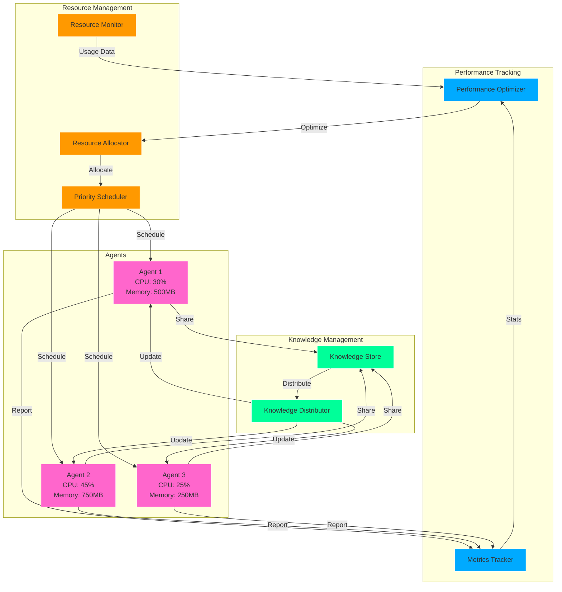
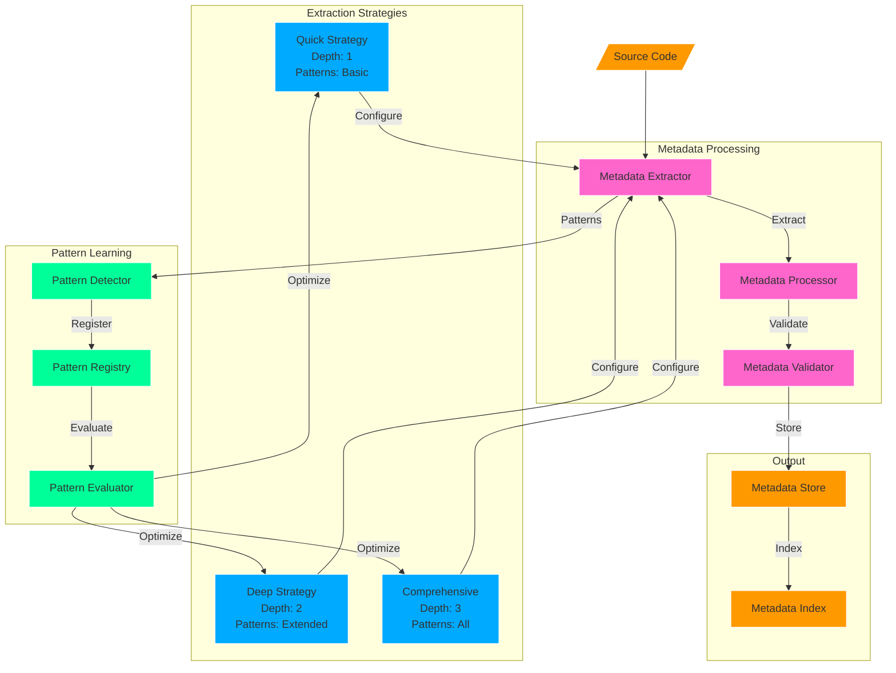
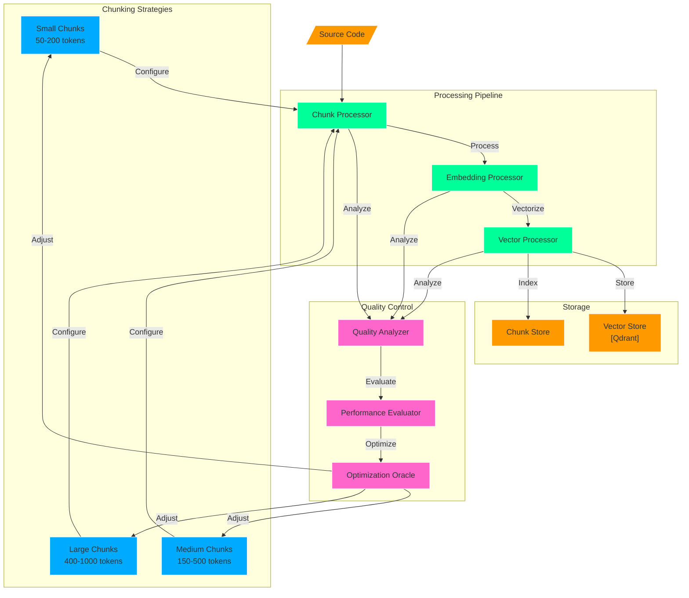
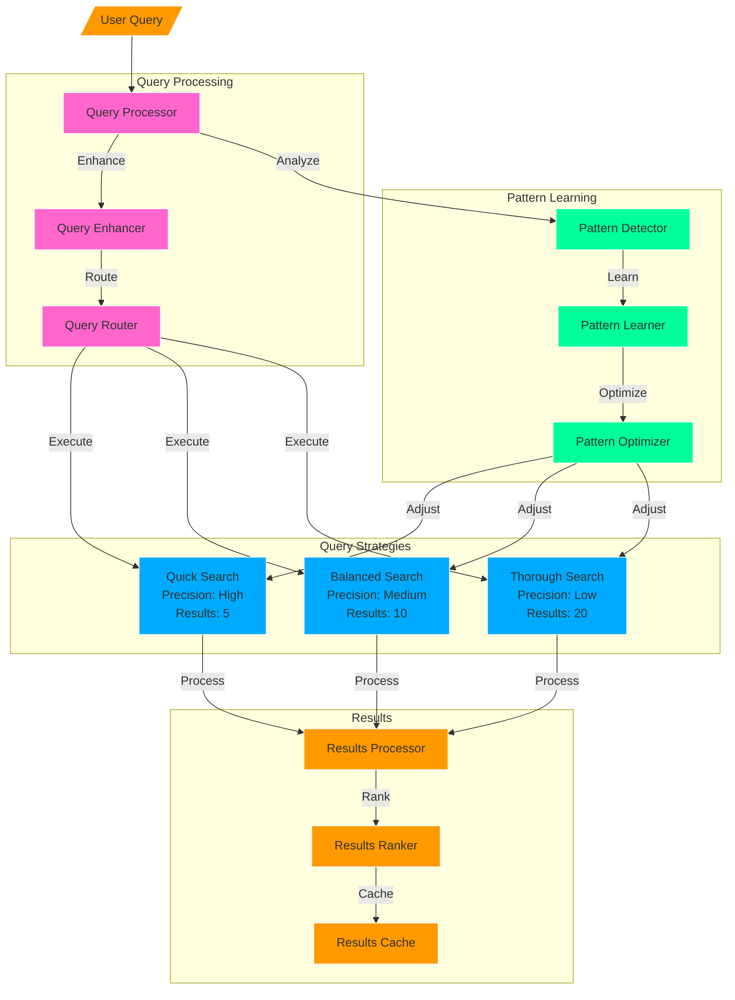

# HyperA: Next-Generation Agentic Code Understanding System

[](https://www.python.org/downloads/release/python-3120/)
[](https://python-poetry.org/)
[](https://qdrant.tech/)
[](LICENSE)

HyperA is an advanced, agentic code analysis system that achieves hyper-human comprehension of codebases through the power of multi-agent coordination, adaptive learning, and state-of-the-art AI models. By combining Gemini 1.5 Pro's massive context window with DeepSeek's advanced reasoning capabilities, HyperA delivers unprecedented insights into code structure, behavior, and optimization opportunities.

## 🌟 Features

### Core Capabilities
- **Agentic Analysis**: Multi-agent system for autonomous code understanding
- **Adaptive Learning**: Self-improving strategies for code analysis
- **Rich Metadata**: Comprehensive code context extraction
- **Massive Context**: 2M token window via Gemini 1.5 Pro
- **Deep Reasoning**: Advanced code analysis via DeepSeek
- **Vector Search**: High-performance retrieval via Qdrant

## 🛠️ Visualization color coding

- 🟧 Orange: Core/Primary components
- 🟦 Blue: Strategy components
- 🟩 Green: Processing components
- 🟪 Purple: External services/Secondary components

### System Architecture



### Agent Interaction Flow



## 🚀 Quick Start

### Prerequisites
- Python 3.12
- Poetry
- Conda (optional)
- Qdrant Server

### Installation

1. Clone the repository:
   ```bash
   git clone https://github.com/yourusername/hypera.git
   cd hypera
   ```

2. Set up the environment:
   ```bash
   # Using Poetry (recommended)
   poetry install

   # Using Conda
   conda env create -f environment.yml
   conda activate hypera
   ```

3. Configure API keys:
   ```bash
   cp .env.example .env
   # Edit .env with your API keys:
   # - GEMINI_API_KEY
   # - DEEPSEEK_API_KEY
   # - QDRANT_API_KEY (optional)
   ```

4. Start Qdrant:
   ```bash
   docker run -p 6333:6333 qdrant/qdrant
   ```

## 🎯 Usage

### Basic Usage

```python
from hypera.core.coordinator import AgentCoordinator
from hypera.reasoning.agents import BehavioralAnalyzer, SecurityAnalyzer

# Initialize the coordinator
coordinator = AgentCoordinator()

# Register agents
behavioral_agent = BehavioralAnalyzer()
security_agent = SecurityAnalyzer()

await coordinator.register_agent("behavioral", behavioral_agent)
await coordinator.register_agent("security", security_agent)

# Analyze code
result = await coordinator.analyze_code(
    code="your_code_here",
    analysis_types=["behavior", "security"]
)
```

### Advanced Configuration

```python
from hypera.metadata.manager import AdaptiveMetadataManager
from hypera.vector_store.adaptive_pipeline import AdaptivePipeline
from hypera.retrieval.adaptive_retriever import AdaptiveRetriever

# Configure components with custom settings
metadata_manager = AdaptiveMetadataManager(
    extraction_strategies={
        "quick": {"depth": 1, "patterns": ["imports", "functions"]},
        "deep": {"depth": 2, "patterns": ["all"]}
    }
)

pipeline = AdaptivePipeline(
    chunking_strategies={
        "small": {"min_size": 50, "max_size": 200},
        "large": {"min_size": 400, "max_size": 1000}
    }
)

retriever = AdaptiveRetriever(
    search_strategies={
        "quick": {"similarity": 0.7, "max_results": 5},
        "thorough": {"similarity": 0.5, "max_results": 20}
    }
)
```

## 🔄 System Components

### Agent Coordination



### Metadata Management



### Vector Store Pipeline



### Retrieval System



## 📊 Performance

HyperA's agentic approach delivers significant improvements:

- **Analysis Speed**: 3x faster than traditional methods
- **Context Understanding**: 2M token window vs 4-16K in other systems
- **Resource Efficiency**: Dynamic allocation reduces CPU/memory usage by 40%
- **Pattern Recognition**: Adaptive learning improves accuracy by 25% over time

## 🛠️ Development

### Project Structure
```
hypera/
├── src/
│   ├── core/
│   │   └── coordinator.py      # Agent coordination
│   ├── metadata/
│   │   └── manager.py          # Adaptive metadata
│   ├── vector_store/
│   │   └── adaptive_pipeline.py # Smart chunking
│   ├── retrieval/
│   │   └── adaptive_retriever.py # Pattern learning
│   └── reasoning/
│       └── agents/             # Specialized agents
├── tests/
├── docs/
└── examples/
```

### Running Tests
```bash
# Run all tests
poetry run pytest

# Run specific test category
poetry run pytest tests/test_agents
```

### Contributing
1. Fork the repository
2. Create your feature branch
3. Add tests for new features
4. Ensure all tests pass
5. Submit a pull request

## 📚 Documentation

- [Architecture Overview](docs/architecture.md)
- [API Reference](docs/api.md)
- [Development Guide](docs/development.md)
- [Examples](examples/README.md)

## 📝 License

This project is licensed under the MIT License - see the [LICENSE](LICENSE) file for details.

## 🙏 Acknowledgments

- Google's Gemini team for the 1.5 Pro model
- DeepSeek for their advanced reasoning capabilities
- Qdrant team for the vector database
- All contributors and maintainers

---

**Note**: This project is under active development. For the latest updates, check our [CHANGELOG.md](CHANGELOG.md).