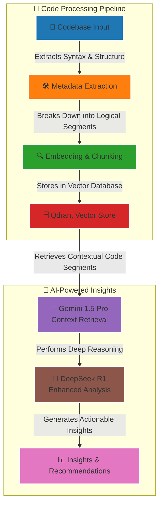

# HyperA

HyperA is a next-generation AI-driven code intelligence system, engineered to provide hyper-human-level understanding of even the most complex software projects. By leveraging advanced AI models, retrieval-augmented generation (RAG), and deep reasoning mechanisms, HyperA delivers detailed code analysis, metadata enrichment, and actionable insights—empowering developers and teams to work faster, smarter, and more efficiently.

## 🚀 Table of Contents

- [Introduction](#introduction)
- [Project Vision](#project-vision)
- [Key Features](#key-features)
- [Architecture Overview](#architecture-overview)
- [RAG Pipeline Flow](#rag-pipeline-flow)
- [Tech Stack & Integration](#tech-stack--integration)
- [Documentation](#documentation)
- [Development Roadmap](#development-roadmap)
- [Getting Started](#getting-started)
- [Contributing](#contributing)
- [License](#license)
- [Contact](#contact)

## 🔥 Introduction

HyperA is in active development—laying the groundwork for a new era of codebase understanding. Our goal is crystal clear: build a system capable of understanding code at a level surpassing human comprehension. Whether you're automating code reviews, security analysis, or performance optimization, HyperA is built to unravel complexity and deliver clarity.

## 🎯 Project Vision

HyperA is designed to redefine codebase intelligence by:

- 📌 Understanding the Unseen – Capturing every nuance: from syntax and structure to module interconnections and data flows.
- 🤖 Harnessing AI at Scale – Using Gemini 1.5 Pro for retrieval and context handling and DeepSeek R1 for deep reasoning and inference.
- 🔍 Integrating Rich Metadata – Embedding AST fragments, function signatures, dependency graphs, and performance metrics.
- 💡 Delivering Actionable Insights – Recommending refactoring strategies, security patches, and performance enhancements—tailored to your codebase.

## ⚙️ Key Features

- 🔎 Advanced Code Analysis – Deep semantic and structural analysis of codebases.
- 🌍 Multi-Language Support – Native support for Python, Rust, TypeScript, and more via AST-based universal representation.
- ⚡ Scalable Vector Storage – Powered by Qdrant, ensuring fast and efficient vector search.
- 🔗 RAG-Driven Retrieval & Reasoning – Seamless retrieval (Gemini 1.5 Pro) + reasoning (DeepSeek R1) for precise, context-aware insights.
- 🛡 Automated Code Reviews & Security Analysis – Identifies vulnerabilities, inefficiencies, and best practices.
- 📦 Modular, Extensible Architecture – Designed for scalability, flexibility, and integration into any development workflow.

## 🏗 Architecture Overview

### HyperA's architecture is designed for scalability, modularity, and high-performance retrieval and analysis. It follows a structured, multi-stage pipeline that ensures every component is optimized for efficiency and insight extraction.

## 🔄 RAG Pipeline Flow

### HyperA's Retrieval-Augmented Generation (RAG) pipeline is the backbone of the system, ensuring precise, context-aware AI-driven insights. The pipeline retrieves, processes, and enhances code understanding at every stage.

```mermaid
graph LR
    subgraph "🟢 Query Processing"
        A[🔍 User Query] -->|Natural Language Parsing| B[📜 Query Parsing]
        B -->|Identifies Relevant Code Context| C[🤖 Custom Retrieval Agents]
    end

    subgraph "🟡 Context Assembly"
        C -->|Fetches Code Segments| D[🗄 Context Assembly from Qdrant]
        D -->|High-Capacity Context Retrieval| E[🧠 Gemini 1.5 Pro\nContext Holder]
    end

    subgraph "🔴 AI Reasoning & Response"
        E -->|Performs Multi-Level Reasoning| F[🧩 DeepSeek R1\nDeep Reasoning]
        F -->|Generates Actionable Insights| G[📊 Generated Response]
    end

    style A fill:#1f77b4,stroke:#ffffff,stroke-width:2px
    style B fill:#ff7f0e,stroke:#ffffff,stroke-width:2px
    style C fill:#2ca02c,stroke:#ffffff,stroke-width:2px
    style D fill:#d62728,stroke:#ffffff,stroke-width:2px
    style E fill:#9467bd,stroke:#ffffff,stroke-width:2px
    style F fill:#8c564b,stroke:#ffffff,stroke-width:2px
    style G fill:#e377c2,stroke:#ffffff,stroke-width:2px
```

## 🛠 Tech Stack & Integration

HyperA is built on a modern, high-performance stack optimized for scalability and precision.

- 📌 Core Languages: Python 3.12
- 🛠 Vector Search: Qdrant (high-speed vector retrieval & metadata filtering)
- 📖 Retrieval Engine: Gemini 1.5 Pro (handling expansive context retrieval)
- 🧠 Reasoning Engine: DeepSeek R1 (advanced AI-powered code understanding)
- 🔗 Orchestration: LangChain / LlamaIndex (pipeline coordination & agent management)
- 📝 Metadata Extraction: Python ast, Tree-sitter (multi-language analysis)
- 🛡 Security & Quality: Pytest, Black, isort, mypy (enforcing best practices)

## 📄 Documentation

HyperA maintains comprehensive documentation to ensure transparency and ease of development:

- 📜 `OBJECTIVE.md` – Defines the core vision, goals, and strategy.
- 🏗 `DEVELOPMENT_PLAN.md` – Outlines milestones, roadmap, and technical blueprints.
- 🛠 `CHANGELOG.md` – Tracks major updates, improvements, and bug fixes.
- 📂 All documentation is located in the `/docs` folder.

## 📅 Development Roadmap

HyperA follows a structured, milestone-driven roadmap:

1. ✅ **Phase 1: Foundation & Infrastructure**
   - Set up project structure, CI/CD pipelines, metadata extraction.
2. 🚀 **Phase 2: Vector Storage & Retrieval**
   - Implement Qdrant, embedding pipelines, and retrieval optimization.
3. 🌎 **Phase 3: Multi-Language Support**
   - Build a universal AST-based metadata extraction engine.
4. 🔍 **Phase 4: Advanced Code Analysis**
   - Implement function signature analysis, type inference, control/data flow analysis.
5. 🔗 **Phase 5: Retrieval System Integration**
   - Integrate Gemini 1.5 Pro for high-context retrieval.
6. 🧠 **Phase 6: Reasoning Engine Integration**
   - Deploy DeepSeek R1 for deep reasoning and intelligent insights.
7. 🔄 **Phase 7: RAG Pipeline Implementation**
   - Implement RAG coordination via LangChain/LlamaIndex.
8. 🏗 **Phase 8: Production Readiness**
   - Finalize real-time analysis, version control integration, API generation.

📖 For a detailed breakdown, refer to `DEVELOPMENT_PLAN.md`.

## 🏁 Getting Started

🚧 Setup instructions coming soon. Stay tuned!

## 🤝 Contributing

HyperA welcomes contributions from the community! If you're interested in contributing:

- Read the `CONTRIBUTING.md` (coming soon).
- Follow the development guidelines.
- Submit PRs and help shape the future of code intelligence.

## 📝 License

📜 License: HyperA is released under the MIT License.

## 📧 Contact

For inquiries, collaborations, or contributions, reach out via:

- 📩 Email: jtperezacle@gmail.com
- 🌐 Website: TBD
- 🔗 GitHub: https://github.com/JtPerez-Acle/hypera

---

🔥 HyperA isn't just a tool—it's an AI-driven paradigm shift in code intelligence.  
💡 Build smarter, optimize faster, and unlock new dimensions of software development.